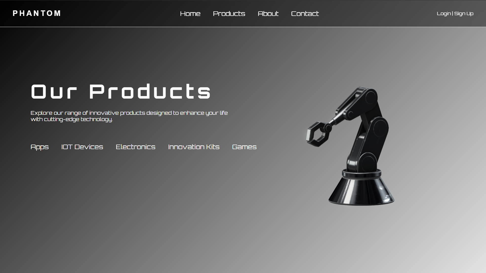
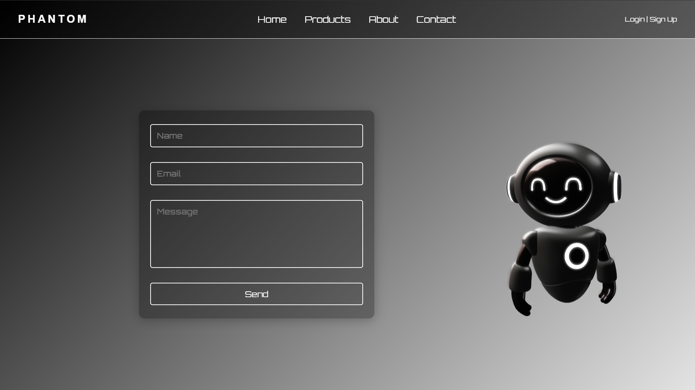

# PHANTOM — Frontend

> *Silently powerful. Visually striking.*

A next-generation tech startup frontend built with cutting-edge design — featuring AI, web development, robotics, smart devices, and more.

🌐 **Live Demo:** [sujay-kr-samal.github.io/Phantom_Frontend](https://sujay-kr-samal.github.io/Phantom_Frontend/)

---

## 📸 Screenshots

### 🏠 Home


### 📦 Products


### 🤖 About Us


### 📬 Contact


---

## ✨ Features

- 🖤 Sleek dark-themed UI with smooth gradients
- 🧭 Multi-page navigation — Home, Products, About, Contact
- 🤖 Animated 3D robot visuals
- 📱 Responsive layout
- 🔐 Login / Sign Up flow
- 📩 Contact form with Name, Email & Message fields

---

## 🛠️ Tech Stack

| Technology | Usage |
|---|---|
| HTML5 | Structure |
| CSS3 | Styling & Animations |
| JavaScript | Interactivity |
| GitHub Pages | Deployment |

---

## 🚀 Getting Started

```bash
# Clone the repository
git clone https://github.com/sujay-kr-samal/Phantom_Frontend.git

# Navigate into the project
cd Phantom_Frontend

# Open in browser
open index.html
```

---

## 📁 Project Structure

```
Phantom_Frontend/
├── index.html
├── assetes/
│   ├── home.png
│   ├── products.png
│   ├── about.png
│   └── contact.png
├── css/
│   └── style.css
└── js/
    └── script.js
```

---

## 🌐 Pages

| Page | Description |
|---|---|
| **Home** | Hero section with a bold humanoid robot visual |
| **Products** | Showcases Apps, IoT Devices, Electronics, Innovation Kits & Games |
| **About** | Company mission & social media links |
| **Contact** | Contact form with a friendly robot mascot |

---

## 👤 Author

**Sujay Kr Samal**
- GitHub: [@sujay-kr-samal](https://github.com/sujay-kr-samal)

---

## 📄 License

This project is open source and available under the [MIT License](LICENSE).

---

<p align="center">Made with 🖤 by Sujay Kr Samal</p>
